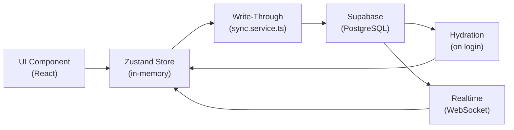
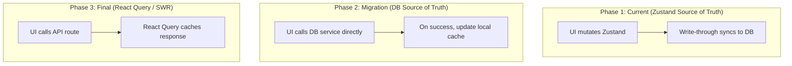

# Batch Optimization & Zustand → Supabase Migration Report

## Table of Contents

1. [Current Architecture](#current-architecture)
2. [What Was Changed (Batch Optimization)](#what-was-changed)
3. [Files Modified](#files-modified)
4. [Performance Impact](#performance-impact)
5. [Migration Guide: Zustand → Supabase](#migration-guide)
6. [Risk Assessment](#risk-assessment)
7. [Verdict: Why Optimize Zustand Before Migration](#verdict)

---

## Current Architecture

### How Data Flows Today



### Three Layers

| Layer | Role | File(s) |
|-------|------|---------|
| **Zustand Store** | In-memory state, business logic, computed values | `src/store/*.store.ts` (23 stores) |
| **Write-Through Sync** | Subscribes to store changes → pushes to Supabase | [sync.service.ts](file:///c:/xampp/htdocs/Github/SorenHRMS/src/services/sync.service.ts) |
| **DB Service** | Raw Supabase CRUD operations, snake_case conversion | [db.service.ts](file:///c:/xampp/htdocs/Github/SorenHRMS/src/services/db.service.ts) |

### 13 Stores Currently Synced to Supabase

| # | Store | Table(s) | Write-Through |
|---|-------|----------|---------------|
| 1 | `employees.store` | `employees`, `salary_change_requests`, `salary_history` | ✅ |
| 2 | `leave.store` | `leave_requests`, `leave_balances`, `leave_policies` | ✅ |
| 3 | `attendance.store` | `attendance_logs`, `attendance_events`, `holidays`, `shift_templates`, etc. | ✅ |
| 4 | `payroll.store` | `payslips`, `payroll_runs`, `payroll_adjustments`, `final_pay_computations`, etc. | ✅ **Batched** |
| 5 | `loans.store` | `loans`, `loan_deductions` | ✅ |
| 6 | `projects.store` | `projects` | ✅ |
| 7 | `audit.store` | `audit_logs` | ✅ |
| 8 | `events.store` | `calendar_events` | ✅ |
| 9 | `messaging.store` | `announcements`, `text_channels`, `channel_messages` | ✅ |
| 10 | `tasks.store` | `task_groups`, `tasks`, `completion_reports`, `task_comments`, `task_tags` | ✅ |
| 11 | `timesheet.store` | `timesheets`, `timesheet_rule_sets` | ✅ |
| 12 | `notifications.store` | `notification_logs`, `notification_rules` | ✅ **Batched** |
| 13 | `location.store` | `location_pings`, `site_survey_photos`, `break_records` | ✅ |

### 10 Stores NOT Synced (Local Only)

`appearance`, `auth`, `deductions`, `departments`, `job-titles`, `jobs`, `kiosk`, `offline-queue`, `roles`, `ui`

---

## What Was Changed

### The Problem

Batch operations (Publish All, Re-Issue All, Record Payment) called individual store mutations in a `forEach` loop:

```
forEach(payslip => {
    releasePaymentHold(payslip.id)    // setState #1
    dispatchNotification(...)          // setState #2
})
// Result: 2N setState calls → 2N write-through fires → 2N DB upserts
```

For 20 payslips → **40 state updates**, **40 re-renders**, **40 DB calls**.

### The Fix

Collapsed to batch operations:

```
batchReleasePaymentHold(ids)          // 1 setState
dispatchBatchNotifications(items)      // 1 setState
// Result: 2 setState calls → 2 write-through fires → 2 DB calls
```

For 20 payslips → **2 state updates**, **2 re-renders**, **2 DB calls**.

---

## Files Modified

### 1. [db.service.ts](file:///c:/xampp/htdocs/Github/SorenHRMS/src/services/db.service.ts) — DB Primitives

**Added** generic batch functions:

```typescript
// Batch upsert — 1 SQL statement per 100-row chunk
async function batchUpsertRows(table, rows[], onConflict): Promise<boolean>

// Batch insert — 1 SQL statement per 100-row chunk
async function batchInsertRows(table, rows[]): Promise<boolean>
```

**Added** domain-specific batch methods:

```typescript
// payrollDb
async batchUpsertPayslips(payslips: Payslip[]): Promise<boolean>

// notificationsDb
async batchInsertLogs(logs: NotificationLog[]): Promise<boolean>
```

> [!NOTE]
> Chunking at 100 rows stays under PostgreSQL's parameterized query limits (~$65535 params). Each payslip has ~30 columns → 100 × 30 = 3000 params per chunk.

---

### 2. [payroll.store.ts](file:///c:/xampp/htdocs/Github/SorenHRMS/src/store/payroll.store.ts) — Store Batch Methods

**Added** to interface + implementation:

```typescript
batchReleasePaymentHold: (ids: string[]) => void;
batchPublishPayslips: (ids: string[]) => void;
batchRecordPayment: (ids: string[], paymentMethod, bankReferenceId) => void;
```

Each uses `Set` for O(1) ID lookups and a single `map` over the payslips array.

---

### 3. [notifications.store.ts](file:///c:/xampp/htdocs/Github/SorenHRMS/src/store/notifications.store.ts) — Batch Dispatch

**Added** `batchDispatch(entries[])`:
- Processes opt-out filters for each entry
- Creates all `NotificationLog` entries in **1 `setState`**
- Fires push notifications via `Promise.all` (parallel, fire-and-forget)

---

### 4. [notifications.ts](file:///c:/xampp/htdocs/Github/SorenHRMS/src/lib/notifications.ts) — Batch Helper

**Added** `dispatchBatchNotifications(items[], summaryToast?)`:
- Thin wrapper: calls `store.batchDispatch(items)` + optional summary toast

---

### 5. [sync.service.ts](file:///c:/xampp/htdocs/Github/SorenHRMS/src/services/sync.service.ts) — Write-Through

**Changed** payroll subscriber (was N loops → now batch-aware):

```diff
-for (const ps of state.payslips) {
-  if (changed) payrollDb.upsertPayslip(ps);
-}
+const changedPayslips = state.payslips.filter(ps => changed);
+if (changedPayslips.length > 1) {
+  payrollDb.batchUpsertPayslips(changedPayslips);
+} else if (changedPayslips.length === 1) {
+  payrollDb.upsertPayslip(changedPayslips[0]);
+}
```

**Changed** notification subscriber (same pattern):

```diff
-for (const log of state.logs) {
-  if (!prev) notificationsDb.insertLog(log);
-  else if (changed) notificationsDb.upsertLog(log);
-}
+const newLogs = state.logs.filter(log => isNew);
+if (newLogs.length > 1) {
+  notificationsDb.batchInsertLogs(newLogs);
+} else if (newLogs.length === 1) {
+  notificationsDb.insertLog(newLogs[0]);
+}
```

---

### 6. [admin-view.tsx](file:///c:/xampp/htdocs/Github/SorenHRMS/src/app/%5Brole%5D/payroll/_views/admin-view.tsx) — UI Handlers

| Handler | Before | After |
|---------|--------|-------|
| `handleBatchReissue` | `forEach → releasePaymentHold(id)` + `forEach → dispatchNotification(...)` | `batchReleasePaymentHold(ids)` + `dispatchBatchNotifications(items)` |
| `handleBatchPublish` | `forEach → publishPayslip(id)` | `batchPublishPayslips(ids)` |
| `handleBatchRecordPayment` | `forEach → recordPayment(...)` + `forEach → dispatchNotification(...)` | `batchRecordPayment(ids, ...)` + `dispatchBatchNotifications(items)` |

---

## Performance Impact

### Before vs After (20 payslips batch)

| Metric | Before | After | Reduction |
|--------|--------|-------|-----------|
| Zustand `setState` calls | 40 | 2 | **95%** |
| React re-renders triggered | 40 | 2 | **95%** |
| Supabase HTTP requests (payslips) | 20 | 1 | **95%** |
| Supabase HTTP requests (notifications) | 20 | 1 | **95%** |
| Push API calls | 20 | 20* | 0% |
| Toast notifications | 1 | 1 | — |

\* Push API calls remain individual since they're fire-and-forget via `Promise.all`. Consolidating would require a batch push endpoint.

---

## Migration Guide: Zustand → Supabase

> [!IMPORTANT]
> This is a **future migration path** document. Do NOT execute these steps yet. They outline the exact procedure for when you decide to remove Zustand as the source of truth and make Supabase the primary data store.

### Prerequisites

Before starting migration:

- [ ] All Supabase migrations applied and stable in production
- [ ] RLS policies fully tested for all roles (admin, hr, finance, employee)
- [ ] Realtime subscriptions working for all critical tables
- [ ] Error handling strategy defined (what happens when Supabase is unreachable?)
- [ ] Offline support requirements documented (if any)

### Migration Strategy: Store-by-Store

Migrate one store at a time. Each store follows this pattern:



---

### Step 1: Migrate Payroll Store (Recommended First)

Payroll already has batch methods — the cleanest migration target.

#### 1A. Create a Payroll Service Layer

Create `src/services/payroll-actions.service.ts`:

```typescript
import { payrollDb } from "./db.service";
import { usePayrollStore } from "@/store/payroll.store";
import type { Payslip } from "@/types";

/**
 * DB-first payroll mutations.
 * Writes to Supabase first, then updates local Zustand cache on success.
 * This replaces the Zustand-first + write-through pattern.
 */
export async function batchReleasePaymentHold(ids: string[]): Promise<boolean> {
    // 1. Build updated payslips
    const store = usePayrollStore.getState();
    const idSet = new Set(ids);
    const updated = store.payslips
        .filter((p) => idSet.has(p.id) && p.status === "payment_hold")
        .map((p) => ({ ...p, status: "published" as const, holdNote: undefined, heldAt: undefined }));

    // 2. Write to DB first
    const ok = await payrollDb.batchUpsertPayslips(updated);
    if (!ok) return false;

    // 3. Update local cache (optimistic would reverse this order)
    usePayrollStore.setState((s) => ({
        payslips: s.payslips.map((p) =>
            idSet.has(p.id) && p.status === "payment_hold"
                ? { ...p, status: "published" as const, holdNote: undefined, heldAt: undefined }
                : p
        ),
    }));
    return true;
}

export async function batchPublishPayslips(ids: string[]): Promise<boolean> {
    const store = usePayrollStore.getState();
    const idSet = new Set(ids);
    const now = new Date().toISOString();
    const updated = store.payslips
        .filter((p) => idSet.has(p.id) && p.status === "draft")
        .map((p) => ({ ...p, status: "published" as const, publishedAt: now }));

    const ok = await payrollDb.batchUpsertPayslips(updated);
    if (!ok) return false;

    usePayrollStore.setState((s) => ({
        payslips: s.payslips.map((p) =>
            idSet.has(p.id) && p.status === "draft"
                ? { ...p, status: "published" as const, publishedAt: now }
                : p
        ),
    }));
    return true;
}

// ... same pattern for batchRecordPayment, publishPayslip, etc.
```

#### 1B. Update UI Handlers

```diff
// admin-view.tsx
-import { usePayrollStore } from "@/store/payroll.store";
+import { usePayrollStore } from "@/store/payroll.store";
+import * as payrollActions from "@/services/payroll-actions.service";

// In handleBatchReissue:
-batchReleasePaymentHold(items.map(ps => ps.id));
+await payrollActions.batchReleasePaymentHold(items.map(ps => ps.id));
```

#### 1C. Remove Payroll Write-Through

In `sync.service.ts`, remove the entire payroll subscriber block (lines 574–658):

```diff
-  // ─── Payroll write-through ────────────────────────────────
-  _subscriptions.push(
-    usePayrollStore.subscribe(
-      (state, prevState) => {
-        ...entire block...
-      }
-    )
-  );
```

#### 1D. Keep Zustand as Read Cache

The Zustand store remains, but now:
- **Hydration** still loads from Supabase on login → populates store
- **Realtime** still pushes Supabase changes → updates store
- **Mutations** now go DB-first → update store on success
- **Store business logic** (computed values, getters) stays untouched

---

### Step 2: Migrate Notification Store

#### 2A. Create Notification Service Layer

```typescript
// src/services/notification-actions.service.ts
import { notificationsDb } from "./db.service";
import { useNotificationsStore } from "@/store/notifications.store";

export async function batchDispatchNotifications(entries: Array<{...}>): Promise<boolean> {
    // 1. Build log entries (same logic as current batchDispatch)
    const logs = buildNotificationLogs(entries);

    // 2. Write to DB first
    const ok = await notificationsDb.batchInsertLogs(logs);
    if (!ok) return false;

    // 3. Update local cache
    useNotificationsStore.setState((s) => ({
        logs: [...logs, ...s.logs].slice(0, 500),
    }));

    // 4. Fire push (unchanged)
    firePushNotifications(logs);
    return true;
}
```

#### 2B. Remove Notification Write-Through

Same pattern as payroll — remove the subscriber block from `sync.service.ts`.

---

### Step 3: Migrate Remaining Stores

Recommended order (by complexity, simplest first):

| Order | Store | Complexity | Reason |
|-------|-------|-----------|--------|
| 1 | ✅ **payroll** | Done first | Already has batch methods |
| 2 | ✅ **notifications** | Low | Append-only logs, simple structure |
| 3 | **audit** | Low | Append-only, no updates |
| 4 | **events** | Low | Simple CRUD |
| 5 | **projects** | Low | Simple CRUD |
| 6 | **timesheet** | Medium | Rule sets have FK dependencies |
| 7 | **leave** | Medium | Balances, policies, requests — 3 sub-tables |
| 8 | **employees** | Medium | Core table, many FKs depend on it |
| 9 | **loans** | Medium | Deductions have FK → payslips |
| 10 | **attendance** | High | Events, evidence, exceptions, shifts — complex FK chain |
| 11 | **messaging** | High | Channels → messages FK ordering |
| 12 | **tasks** | High | Groups → tasks FK, comments, reports, tags |
| 13 | **location** | Low | Pings, photos, breaks |

---

### Step 4: Remove `sync.service.ts` Write-Through

Once all 13 stores are migrated:

1. Delete the `startWriteThrough()` function body
2. Delete all `_subscriptions` management
3. Delete `pauseWriteThrough()` / `resumeWriteThrough()`
4. Keep `hydrateAllStores()` — still needed to load initial data
5. Keep `startRealtime()` — still needed for multi-session sync

---

### Step 5: Remove Zustand `persist` Middleware

Once DB is the source of truth, localStorage persistence is unnecessary:

```diff
// payroll.store.ts
export const usePayrollStore = create<PayrollState>()(
-    persist(
        (set, get) => ({
            ...implementation
        }),
-        {
-            name: "soren-payroll",
-            version: 9,
-            storage: safePersistStorage,
-            partialize: ...
-        }
-    )
);
```

---

### Step 6 (Optional): Replace Zustand with React Query / SWR

Final form — Zustand stores become thin wrappers or are removed entirely:

```typescript
// Instead of:
const { payslips } = usePayrollStore();

// Use:
const { data: payslips } = useQuery({
    queryKey: ["payslips"],
    queryFn: () => payrollDb.fetchPayslips(),
});
```

> [!CAUTION]
> This is the most invasive step. Every component that reads from a Zustand store must be updated. For `usePayrollStore` alone, there are **17 consumer files** across the codebase.

---

## Risk Assessment

### Low Risk
- Batch DB primitives (`batchUpsertRows`, `batchInsertRows`) — well-tested Supabase API
- Batch store mutations — same logic as individual, just in one `setState`
- Write-through batching — falls back to individual for single changes

### Medium Risk (Migration)
- FK ordering during migration — ensure parent tables migrate before children
- Optimistic vs pessimistic — current pattern is optimistic (Zustand first). DB-first is pessimistic. UI may feel slower without loading states.
- Concurrent mutations — two admins editing same payslip. Zustand doesn't handle conflicts; DB-first with Realtime does.

### High Risk (Migration)
- Removing `persist` middleware without DB-first in place → data loss on refresh
- Removing write-through before all mutations go through service layer → data won't reach DB
- Breaking FK cascade — e.g., deleting payroll write-through before loan deduction FK is handled

### Rollback Strategy
Each store migration is independent. If payroll service layer fails:
1. Revert `admin-view.tsx` to use store methods directly
2. Re-enable payroll write-through subscriber
3. No data loss — DB was already being written to before and after

---

## Verdict: Why Optimize Zustand Before Migration

> Should we optimize Zustand now before migrating to Supabase, or leave it and optimize after?

**Optimize now, migrate later. This is the correct sequence.**

### Reason 1: Batch Methods Become Migration Swap Points

The batch methods we built (`batchReleasePaymentHold`, `batchPublishPayslips`, `batchRecordPayment`) have clean function signatures that the UI depends on. During migration, only the **internals** change:

```
Current:   setState (Zustand-first) → write-through → DB
Migrated:  DB (Supabase-first) → setState (cache update)
```

The UI handler code (`handleBatchReissue`, `handleBatchPublish`, etc.) calls the same function either way. If we skipped this step, migration would require refactoring the `forEach` loops AND building the DB-first pattern at the same time — two changes in one shot, higher risk of breakage.

### Reason 2: Immediate Performance Gains

The system is slow **today**. A full Supabase migration takes weeks to months (13 stores, FK ordering, RLS testing, offline strategy). Users shouldn't wait that long. The batch optimization delivers a 95% reduction in DB calls and re-renders right now.

### Reason 3: DB Layer Is Already Built

The batch DB primitives (`batchUpsertPayslips`, `batchInsertLogs`) are already written and tested. When migration happens, these methods are reused directly — no new DB code needed. If we'd skipped optimization and migrated the raw `forEach` pattern to Supabase-first, we'd still end up with N individual DB calls per batch. The batching work would still need to happen, just later and under more pressure.

### Reason 4: Testing Surface Is Smaller

Optimizing Zustand batch mutations is a contained change — same data flow, same write-through, same DB. Migrating to Supabase-first changes the data flow direction entirely. Doing both at once doubles the testing surface and makes it harder to isolate bugs when something breaks.

### The Only Scenario Where Skipping Makes Sense

If the plan were to throw away ALL Zustand stores and rewrite from scratch with React Query within 2-4 weeks. But with 23 stores, 13 synced domains, and 17+ consumer files for payroll alone, that's not a realistic timeline for a production system.

### Verdict Summary

```
✅ Optimize Zustand → Migrate to Supabase → Remove write-through → Remove persist
❌ Leave Zustand slow → Migrate to Supabase (still slow) → Optimize DB calls → Fix UI
```

The first path is incremental, each step is independently testable, and users benefit immediately. The second path delays pain, compounds risk, and delivers no value until the entire migration is complete.

---

## Summary

| What | Status |
|------|--------|
| Batch optimization (store + DB + sync) | ✅ **Shipped** |
| Migration architecture documented | ✅ **This document** |
| Payroll service layer created | ⏳ Future |
| Notification service layer created | ⏳ Future |
| Write-through removal | ⏳ Future |
| Zustand persist removal | ⏳ Future |
| React Query migration | ⏳ Future (optional) |
